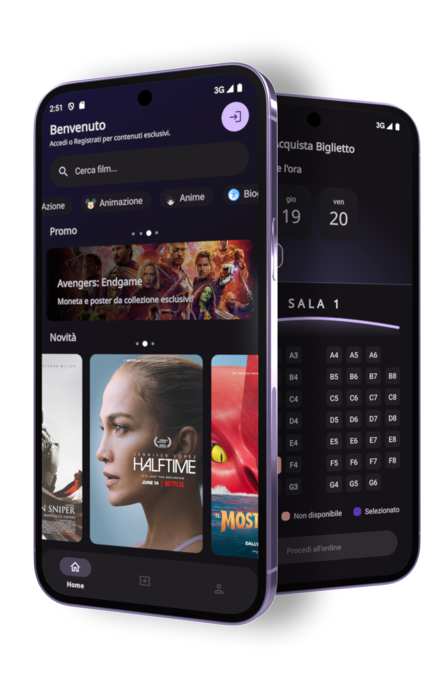

# ARPA

### Progetto per l'esame finale di **Programmazione Web e Mobile**  
*Valutazione: Massimo dei voti*

---

### Creato da:
- **Aurora Amoroso**
- **Riccardo Parisi**

**ARPA** è un'applicazione progettata per gestire un cinema multisala, integrando funzionalità avanzate per la prenotazione dei biglietti, gestione delle sale e delle proiezioni. L'interfaccia utente intuitiva e reattiva garantisce un'esperienza ottimale per gli utenti.

---

> _Un progetto che unisce innovazione e funzionalità, con un focus sull'esperienza utente._

---
